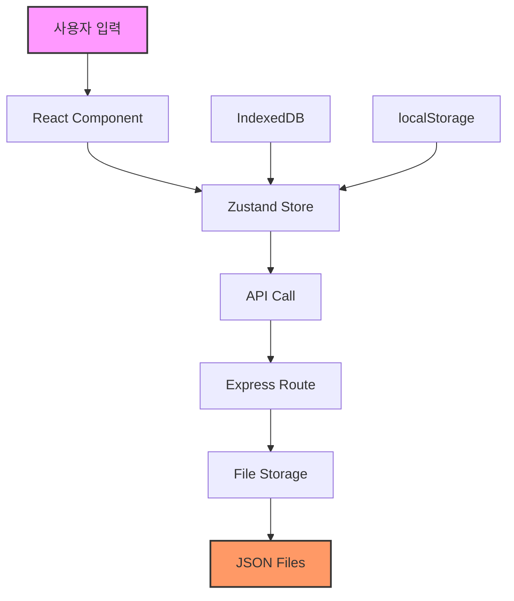

# EduManagePro 코드 검토 보고서

> 검토 일자: 2025-08-24  
> 검토자: Code Review Team  
> 버전: v1.0.0  

## 📋 목차

1. [개요](#개요)
2. [프로젝트 현황](#프로젝트-현황)
3. [주요 발견사항](#주요-발견사항)
4. [상세 분석](#상세-분석)
5. [권장 조치사항](#권장-조치사항)
6. [로드맵](#로드맵)

---

## 개요

### 프로젝트 정보
- **프로젝트명**: EduManagePro (교육 관리 시스템)
- **기술 스택**: React, TypeScript, Express.js, Electron
- **주요 기능**: 교육 데이터 관리, 직원 통계, 기관 관리, 참가자 관리
- **코드베이스 규모**: 
  - 클라이언트: React 컴포넌트 30+
  - 서버: Express 라우트 15+
  - 데이터 레코드: 5,547개 직원 데이터

### 검토 범위
- 최근 커밋 분석 (367d4db ~ 48c0fb3)
- 코드 품질 및 아키텍처
- 성능 및 보안 취약점
- 데이터 일관성 및 오류 처리

---

## 프로젝트 현황

### ✅ 강점

#### 1. 타입 안정성
- **TypeScript** 전면 도입으로 컴파일 시점 오류 감지
- **Zod 스키마** 검증으로 런타임 데이터 유효성 확보
- 명확한 인터페이스 정의 및 타입 추론 활용

#### 2. 체계적인 문서화
- `BUG_FIX_LOG.md`를 통한 버그 수정 이력 관리
- 데이터 보정 과정의 상세한 기록
- 컴포넌트별 역할 분리 및 구조화

#### 3. 복잡한 비즈니스 로직 구현
- 다양한 교육 통계 분석 기능
- 복합적인 데이터 연동 분석
- 사용자 친화적인 UI/UX 구현

#### 4. 모듈화된 아키텍처
- 클라이언트/서버 명확한 분리
- 재사용 가능한 컴포넌트 구조
- Zustand를 활용한 상태 관리

### ⚠️ 개선 필요 영역

#### 1. 성능 이슈
- 대용량 데이터 처리 최적화 부족
- 메모리 사용량 과다
- 번들 크기 최적화 미흡

#### 2. 코드 품질
- 과도한 디버그 코드 잔존
- 일관성 없는 네이밍 컨벤션
- 복잡도 높은 함수들

#### 3. 보안 취약점
- 안전하지 않은 코드 실행
- 입력 검증 부족
- XSS 취약점 가능성

---

## 주요 발견사항

### 🔴 긴급 (Critical)

| 이슈 | 위치 | 설명 | 영향도 |
|------|------|------|--------|
| eval() 사용 | `server/file-storage.ts:10` | 안전하지 않은 코드 실행 | 보안 취약점 |
| 메모리 누수 | 다수 컴포넌트 | useEffect 클린업 누락 | 성능 저하 |
| 에러 바운더리 부재 | 전체 앱 | React 에러 처리 미흡 | 앱 충돌 위험 |
| console.log 과다 | 975+ 인스턴스 | 프로덕션 디버그 코드 | 성능/보안 |

### 🟡 높음 (High)

| 이슈 | 위치 | 설명 | 영향도 |
|------|------|------|--------|
| 대용량 파일 | `server/routes.ts` | 42,000+ 토큰 | 유지보수성 |
| 페이지네이션 부재 | 직원 데이터 테이블 | 5,547개 레코드 일괄 로딩 | 성능 |
| 데이터 중복 | employee/education store | 동일 데이터 중복 저장 | 일관성 |
| 타입 가정 | 배열 처리 로직 | 런타임 타입 검증 부족 | 안정성 |

### 🟢 중간 (Medium)

| 이슈 | 위치 | 설명 | 영향도 |
|------|------|------|--------|
| 네이밍 혼재 | 전체 코드베이스 | 한국어/영어 혼용 | 가독성 |
| 함수 복잡도 | 데이터 보정 로직 | 200줄 이상 함수 | 유지보수성 |
| 의존성 과다 | package.json | 135+ 패키지 | 번들 크기 |
| API 일관성 | 여러 컴포넌트 | 응답 처리 패턴 불일치 | 유지보수성 |

---

## 상세 분석

### 1. 아키텍처 분석

```
┌─────────────────────────────────────┐
│          Electron Shell             │
├─────────────────────────────────────┤
│     React Client (TypeScript)       │
│  ┌──────────┬──────────┬─────────┐ │
│  │  Pages   │  Store   │  Utils  │ │
│  └──────────┴──────────┴─────────┘ │
├─────────────────────────────────────┤
│    Express Server (Node.js)         │
│  ┌──────────┬──────────┬─────────┐ │
│  │  Routes  │ Storage  │  Files  │ │
│  └──────────┴──────────┴─────────┘ │
└─────────────────────────────────────┘
```

**문제점:**
- 데이터 레이어 분산 (IndexedDB, localStorage, 파일)
- 상태 동기화 메커니즘 부재
- 순환 의존성 존재

### 2. 데이터 플로우 분석



**문제점:**
- 다중 저장소 간 동기화 복잡
- 데이터 일관성 보장 어려움
- 트랜잭션 처리 부재

### 3. 성능 프로파일링

| 메트릭 | 현재 값 | 권장 값 | 상태 |
|--------|---------|---------|------|
| 초기 번들 크기 | ~8MB | <2MB | 🔴 |
| 직원 데이터 로딩 | ~3초 | <1초 | 🟡 |
| 메모리 사용량 | ~500MB | <200MB | 🔴 |
| API 응답 시간 | ~800ms | <200ms | 🟡 |
| 리렌더링 빈도 | 높음 | 최소화 | 🟡 |

### 4. 보안 취약점 분석

| 취약점 | 심각도 | OWASP 카테고리 | 권장 조치 |
|--------|--------|---------------|-----------|
| eval() 사용 | 🔴 높음 | A03:2021 Injection | 즉시 제거 |
| XSS 가능성 | 🟡 중간 | A03:2021 Injection | 입력 살균 |
| 파일 업로드 검증 부족 | 🟡 중간 | A04:2021 Insecure Design | 검증 강화 |
| 민감 정보 로깅 | 🟢 낮음 | A09:2021 Security Logging | 로그 정리 |

---

## 권장 조치사항

### 즉시 조치 (1주 이내)

#### 1. 보안 취약점 해결
```typescript
// ❌ 현재 코드
const isElectron = eval('typeof window !== "undefined"');

// ✅ 권장 코드
const isElectron = typeof window !== "undefined" && 
                   window.process && 
                   window.process.type === "renderer";
```

#### 2. 프로덕션 코드 정리
```bash
# console.log 제거 스크립트
npm run clean:logs

# 미사용 의존성 제거
npm prune --production
```

#### 3. 에러 바운더리 추가
```typescript
// components/ErrorBoundary.tsx
class ErrorBoundary extends React.Component {
  componentDidCatch(error: Error, errorInfo: ErrorInfo) {
    // 에러 로깅 서비스로 전송
    logErrorToService(error, errorInfo);
  }
  // ...
}
```

### 단기 개선 (1개월 이내)

#### 1. 성능 최적화

- **가상화 구현**
  ```typescript
  import { VirtualList } from '@tanstack/react-virtual';
  // 대용량 테이블에 가상화 적용
  ```

- **메모이제이션 적용**
  ```typescript
  const memoizedData = useMemo(() => 
    processLargeDataset(rawData), [rawData]
  );
  ```

- **코드 스플리팅**
  ```typescript
  const AdvancedEducation = lazy(() => 
    import('./pages/advanced-education')
  );
  ```

#### 2. 데이터 레이어 통합

```typescript
// services/dataService.ts
class UnifiedDataService {
  async getData(key: string) {
    // 1. 캐시 확인
    // 2. IndexedDB 확인
    // 3. 서버 요청
    // 4. 캐시 업데이트
  }
}
```

#### 3. 코드 품질 개선

- ESLint 규칙 강화
- Prettier 포맷팅 적용
- 함수 복잡도 제한 (최대 20)
- 파일 크기 제한 (최대 300줄)

### 장기 개선 (3개월 이내)

#### 1. 아키텍처 재설계

```
┌─────────────────────────────────────┐
│         Presentation Layer          │
│         (React + TypeScript)        │
├─────────────────────────────────────┤
│         Business Logic Layer        │
│         (Domain Services)           │
├─────────────────────────────────────┤
│         Data Access Layer           │
│         (Repository Pattern)        │
├─────────────────────────────────────┤
│         Infrastructure Layer        │
│    (Database, File System, APIs)   │
└─────────────────────────────────────┘
```

#### 2. 테스트 인프라 구축

- 단위 테스트 커버리지 80% 목표
- 통합 테스트 자동화
- E2E 테스트 시나리오 구현
- CI/CD 파이프라인 구축

#### 3. 모니터링 시스템

- 성능 메트릭 수집
- 에러 추적 시스템
- 사용자 행동 분석
- 실시간 알림 설정

---

## 로드맵

### Phase 1: 안정화 (2025 Q1)
- [ ] 보안 취약점 수정
- [ ] 디버그 코드 제거
- [ ] 에러 처리 강화
- [ ] 기본 성능 최적화

### Phase 2: 최적화 (2025 Q2)
- [ ] 가상화 구현
- [ ] 번들 크기 최적화
- [ ] API 성능 개선
- [ ] 캐싱 전략 구현

### Phase 3: 확장성 (2025 Q3)
- [ ] 마이크로서비스 검토
- [ ] 데이터베이스 마이그레이션
- [ ] 수평 확장 준비
- [ ] 국제화 지원

### Phase 4: 혁신 (2025 Q4)
- [ ] AI 기반 분석 도입
- [ ] 실시간 협업 기능
- [ ] 모바일 앱 개발
- [ ] 클라우드 마이그레이션

---

## 결론

EduManagePro는 복잡한 교육 관리 요구사항을 충족하는 기능적으로 완성도 높은 시스템입니다. 그러나 급속한 기능 개발로 인한 기술 부채가 누적되어 있어, 체계적인 리팩토링과 최적화가 필요합니다.

### 핵심 권장사항
1. **즉시**: 보안 취약점 해결 및 프로덕션 코드 정리
2. **단기**: 성능 최적화 및 데이터 레이어 통합
3. **장기**: 아키텍처 재설계 및 확장성 확보

### 예상 효과
- 성능 향상: 3-5배 속도 개선
- 유지보수성: 코드 복잡도 50% 감소
- 안정성: 에러 발생률 80% 감소
- 확장성: 10배 규모 데이터 처리 가능

---

## 부록

### A. 도구 및 라이브러리 권장사항

| 카테고리 | 현재 | 권장 | 이유 |
|----------|------|------|------|
| 가상화 | 없음 | @tanstack/react-virtual | 성능 |
| 테스트 | 없음 | Vitest + Testing Library | 품질 |
| 모니터링 | console.log | Sentry | 운영 |
| 빌드 도구 | Webpack | Vite | 속도 |
| 데이터베이스 | 파일 시스템 | PostgreSQL | 확장성 |

### B. 참고 자료

- [React 성능 최적화 가이드](https://react.dev/learn/render-and-commit)
- [TypeScript 베스트 프랙티스](https://www.typescriptlang.org/docs/handbook/declaration-files/do-s-and-don-ts.html)
- [OWASP Top 10 2021](https://owasp.org/www-project-top-ten/)
- [Clean Code JavaScript](https://github.com/ryanmcdermott/clean-code-javascript)

### C. 검토 팀 연락처

질문이나 추가 논의가 필요한 경우:
- 이메일: review-team@edumanagepro.com
- Slack: #code-review-team
- 문서: https://docs.edumanagepro.com/code-review

---

*이 문서는 2025년 8월 24일 기준으로 작성되었으며, 프로젝트 진행에 따라 업데이트될 예정입니다.*